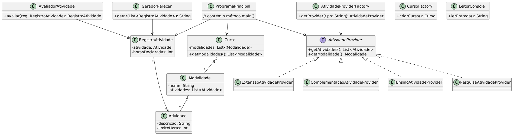
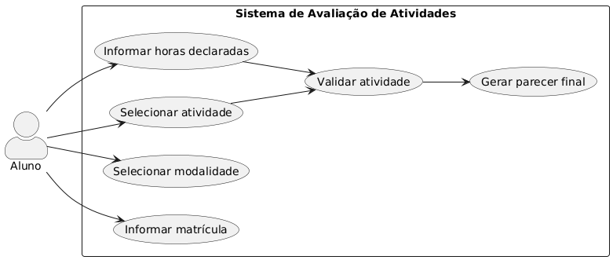

# Sistema de Avaliação de Atividades Complementares

Este projeto tem como objetivo o desenvolvimento de um sistema em Java para automatizar a avaliação de atividades complementares dos cursos superiores do **IFSC - Câmpus Tubarão**. As regras para validação seguem os critérios estabelecidos na Resolução 007/2017.

---

## 🎯 Objetivo

Automatizar o processo de validação das atividades complementares com base nas quatro modalidades definidas:

- **Ensino**
- **Pesquisa**
- **Extensão**
- **Complementação**

---

## 📌 Funcionalidades

- Menu interativo por modalidade (Ensino, Pesquisa e Inovação, Extensão, Complementação);
- Cadastro de atividades com horas declaradas;
- Cálculo automático de horas validadas com base no limite permitido;
- Geração de parecer detalhado com observações.

---

## 📁 Estrutura do Projeto

O projeto é organizado em pacotes:

- `model` – classes que representam os dados principais (`Curso`, `Modalidade`, `Atividade`, `RegistroAtividade`)
- `service` – lógica de negócio e aplicação de regras (`AvaliadorAtividade`, `GeradorParecer`, `AtividadeProvider`)
- `util` – utilitários de entrada, como `LeitorConsole`
- `main` – contém o `ProgramaPrincipal` com a execução do sistema

---

## 🧠 Padrões e Princípios Aplicados

- **Factory Method**: usado para criar provedores por modalidade.
- **DAO (Data Access Object)**: separa a lógica de acesso a dados da lógica de negócios.
- **MVC (Model-View-Controller)**: separa a interface, regras de negócio e dados.

---

## 🖼️ Diagramas UML

### 📌 Diagrama de Classes
Apresenta uma visão geral das principais classes, seus relacionamentos e as responsabilidades centrais do sistema. Ele evidencia a separação entre modelo, lógica de negócio e entrada de dados.

---

### 📌 Diagrama de Casos de Uso

O diagrama de casos de uso representa as interações do aluno com o sistema. Ele descreve as funcionalidades principais acessadas via terminal: desde a matrícula até a geração do parecer com as atividades validadas.

---

### Pré-requisitos
- Java JDK 17+
- IDE como IntelliJ ou Eclipse

---

## 🛠️ Como Executar

1. Compile o projeto normalmente.
2. Execute a classe `ProgramaPrincipal`.
3. Siga as instruções no terminal para selecionar modalidades, atividades e horas.
4. Ao finalizar, o sistema exibirá o parecer com as horas validadas.

---

## 📅 Entrega

- **👤 Autores: Haruan Rechia da Silva, Pedro Henrique Martins Santos e Raul Nandi de Pieri**  
- Este repositório representa a versão final entregue para avaliação.

---

## 📚 Base normativa

- Resolução nº 007/2017 – IFSC Câmpus Tubarão

---
